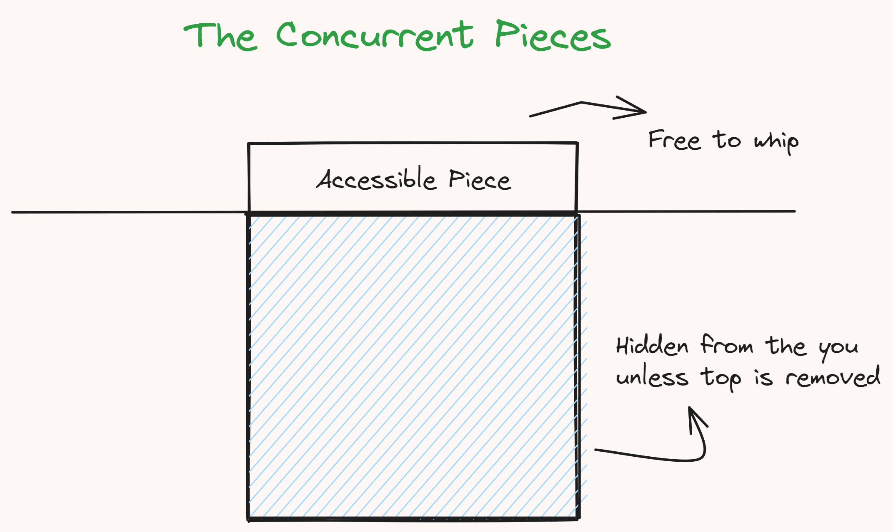

## Some Background

Well in real life, we are often advised to do one thing at a time and do it perfectly. Did I just use the UNIX philosophy and applied it to real life? Well, yes. I am a nerd.
Programs too, most times are better off doing just one thing and doing it perfectly.
However, it takes a whole 360 degree turn when it comes to computing. The keyword here being computing. Not the fancy CLI's and GUI's we use. Computing is a very broad term and it includes a lot of things. One of them being concurrency.
So let's give a text book definition first shall we:

> Concurrency is the ability of different parts or units of a program, algorithm, or problem to be executed out-of-order or in partial order, without affecting the final outcome.

Basically, the program is able to do multiple things at once. So, let's look inside this a bit more. There are two types of concurrency:

- **Parallelism**: This is when the program is able to do multiple things at once. This is the most common type of concurrency. This is what we are going to be talking about in this post.
- **Asynchronous**: This is when the program is able to do multiple things at once, but not exactly at the same time. This is a bit more complicated and we will talk about it in a later post.

So, let's get into the whole thing shall we, but first, let's talk about the anti pattern of concurrency: Synchronous programming.

## Jargon Buster and Basics

Before we get into the whole thing, here is a small jargon buster for you:

- **Blocking**: Blocking is when the program is waiting for something to happen. For example, if you are reading from a file, the program will be blocked until the file is read.
- **Thread**: A thread is the most basic unit of execution. A process can have multiple threads. Each and every thread in a memory space has access to the same memory. Hence, they can share state between each other.
- **Process**: A process is a program that is running. A process can have multiple threads. Each process has its own memory space.
- **Daemon**: A daemon is a process that runs in the background.
- **IPC**: IPC stands for Inter Process Communication. It is a mechanism that allows processes to communicate with each other. This can be done using TCP/IP, Sockets, Message Queues, etc.
- **Operation**: An operation is a task that the program has to do. For example, reading from a file is an operation.

## Synchronous Programming

Synchronous programming is when the program does one thing at a time. 
Let's say we have a very simple web server written in go and it has to do some algorithmic computation. So, it will do the computation and then send the response to the client.
For every request sent, imagine an imaginary plate stack. The program will take a plate from the stack, do the computation and then send the response.

Essentially when you imagine a stack of plates, you put all the plates on the fancy plate stack the pops out the plates one by one. This is how synchronous programming works. It does one thing at a time and only then exposes the next thing to do.



Hence, if you are doing a lot of computation, the program will be blocked until the computation is done. 
Let's say that you are reading from an external API, and the API is slow. The program will essentially be blocked until the API responds. 
Hence, your program is essentially choke holding itself. 
This is where the concept of _concurrency_ comes in.

## Concurrency

Now imagine you **tilt** the plate stack to be horizontal. You can now do multiple things at once. You can take _any_ plate from the stack and enjoy the yummy food (computations) on it.
So, essentially, your program is no longer _blocked_ by a long computation. It can do other computations while the long computation is going on.
In fact, it doesn't matter if the computation is long or short, the program can do other things while the computation is going on.


Hence concurrency sort of does stuff in parallel. It is not exactly parallelism, but it is close enough.
We will be differentiating between concurrency and parallelism in a bit.
Regardless, this pattern of programming is called _concurrent programming_.

Async and Concurrent are used interchangeably, however, as I mentioned in the beginning, they are not the same thing.
Asynchronous programming is a subset of concurrent programming.
So what are the other subsets of concurrent programming?

## Classification of Concurrences

There are boardly three types of concurrent programming:

1. MultiThreading
2. MultiProcessing
3. Asynchronous

Let's talk about each of them one by one.

### MultiThreading

MultiThreading is often confused with parallelism. However, it is not the same thing.
MultiThreading is when you have multiple threads of execution in a single process.
A thread is the most basic unit of execution. A process can have multiple threads.
Each and every thread in a memory space has access to the same memory. Hence, they can share state between each other.
This solves the problem of blocking. If one thread is blocked, the other threads can continue to do their work.
We will be talking more about blocking in a bit.

You can think of a thread as a worker. Each worker has a task to do. If one worker is blocked, the other workers can continue to do their work.
Hence, essentially, you are running a main worker called the daemon and the daemon is _spawning_ multiple workers to do the work, while it self is not able to interfere with the worker's state.
You might have heard of the term _daemon_ in UNIX. A daemon is a process that runs in the background.

### MultiProcessing

MultiProcessing is when you have multiple processes running at the same time. Each process has its own memory space and hence, they cannot share state between each other.
This is particularly useful for a micro service like architecture. Each process can be a micro service and they can communicate with each other using some sort of IPC (Inter Process Communication) mechanism.
These methods can vary from TCP/IP to Sockets to even message queues.
MultiProcessing finds its use in distributed systems and in micro service architectures.

### Asynchronous

An async operation runs on a single thread know as the event loop. This event loop is responsible for running the async operations.
The event loop is non blocking and hence, it can run multiple async operations at the same time.

However, the async operations are not exactly running at the same time. They are running one after the other, but they are not blocking each other.
What I mean by blocking is that the event loop is not waiting for the actual data. It operates on the _promise_ of the data. This might be a bit familiar if you have used JavaScript.
The event loop is not waiting for the data to come back from the API. It is just waiting for the promise of the data to come back. Once the promise is fulfilled, the event loop will run something called a _callback_ function. The promise is called using the _await_ keyword in most languages.

```js
let res = new Promise((resolve, reject) => {
  // do something
  resolve("Hello World");
});

let data = await res;
```

In the above example, the program interperts data as a promise that will be fulfilled by the variable res. Once the promise is fulfilled, the program will run the next line of code.
So, the program can operate on the principle of promises. This is what async programming is.

This is basically like you using one company's stocks to buy another company's stocks. You are essentially operating on the promise of the first company's stocks inherent value and you will be able to buy the second company's stocks.

Asynchronous is hence the most basic form of concurrency. You don't have something running in parallel technically, but sort of dismissed on the basis of the promise of the data.
This helps the event loop to run multiple operations at the same time.
There is a very famous talk by Philip Roberts on the event loops that gets into the nitty gritty of how the event loop works. I highly recommend you to watch it.

import YouTube from "../../../components/utils/md/social/youtube.astro"

<YouTube id="8aGhZQkoFbQ" />

I plan on doing a deep dive into async programming in a later post. So stay tuned for that.

## Blocking

Blocking occurs when a program is paused or held up, waiting for a specific event to complete, such as reading data from a file. During this time, the program can't proceed because it relies on the outcome of that event. Concurrency, on the other hand, is a technique that allows a program to continue executing other tasks while one or more operations are blocked, enhancing its overall efficiency.

Think of it like a restaurant scenario. You're a waiter taking orders from customers and passing them to the chef. The chef prepares the dishes and hands them back to you, and you serve them to the customers. It sounds straightforward, right?

However, consider a situation where a customer orders a complex dish that takes a long time to cook. In a blocking scenario, the chef would wait until that dish is ready before starting any others, causing delays. This is similar to how a program can get blocked when waiting for a time-consuming operation to complete.

Now, let's introduce concurrency. If the chef decides to cook the complex dish concurrently, it means they can work on other orders while the challenging dish is being prepared. This parallels how a program can continue performing other tasks even while waiting for certain operations to finish. This ability to multitask or work in parallel, like our chef, is the essence of concurrency, making processes more efficient and responsive.

## Understanding through a Go Program

Now, let's understand this through a simple go program.
We want to emulate a web server that some complex algorithmic computation. We will be using the `time.Sleep()` function to emulate the computation and be calculating the time taken to do the computation.

Below is an example of a synchronous program:
```go
package main

import (
    "fmt"
    "time"
)

func main(){
    start := time.Now()
    fmt.Println("Program started")

    fmt.Println(emulateComputation(1))
    fmt.Println(emulateComputation(2))
    fmt.Println(emulateComputation(3))
    fmt.Println(emulateComputation(4))
    fmt.Println(emulateComputation(5))

    fmt.Println("Program ended in", time.Since(start))
}

func emulateComputation(id int) string{
	time.Sleep(1000 * time.Duration(id) * time.Millisecond)

    return "Computation done for " + fmt.Sprint(id)
}
```
Notice how we must first wait for the id 1 computation to finish before we can start the id 2 computation.
This is because the program is synchronous and it can only do one thing at a time.

When we run the program, we get the following output:
```bash
Program started
Computation done for 1
Computation done for 2
Computation done for 3
Computation done for 4
Computation done for 5
Program ended in 15.0052ms
```

So, the program took 15.0052ms to complete. This is because the program is doing one thing at a time and hence, it is blocked by the computation.
Finding the time complexity of this program is pretty easy. It is `O(n)` where `n` is the number of computations.

Now, let's make the program concurrent. We will be using the `go` keyword to make the program concurrent.
```go
package main

import (
	"fmt"
	"sync"
	"time"
)

func main() {
	now := time.Now()

	resch := make(chan int, 5)
	wg := &sync.WaitGroup{}

	go emulateAction(1, resch, wg)
	wg.Add(1)
	go emulateAction(2, resch, wg)
	wg.Add(1)
	go emulateAction(3, resch, wg)
	wg.Add(1)
    go emulateAction(4, resch, wg)
    wg.Add(1)
    go emulateAction(5, resch, wg)
    wg.Add(1)

	go func() {
		wg.Wait()
		close(resch)
	}()

	for res := range resch {
		fmt.Println("Result:", res)
	}

	endProgram(&now)
}

func emulateAction(id int, resch chan int, wg *sync.WaitGroup) {
	time.Sleep(1000 * time.Duration(id) * time.Millisecond)
	resch <- id
	wg.Done()
}

func endProgram(n *time.Time) {
	fmt.Println("Program ended in", time.Since(*n))
}
```

The first one was pretty simple? I know. This one is a bit more complicated. Let's break it down.
So, go has this concept of channels. Channels are a way to communicate between goroutines. Goroutines are like the threads in go.

Essentially a channel is like a way to share state between these different goroutines. It is a type of IPC (Inter Process Communication) mechanism.
I mean, not exactly, but it is close enough. Now, we use a waiting or a blocking mechanism to wait for the goroutines to finish.
The `sync.WaitGroup` is a way to wait for the goroutines to finish. The rest is handled native to go.

When we run the program, we get the following output:
```bash
Program started
Result: 1
Result: 2
Result: 3
Result: 4
Result: 5
Program ended in 5.0120ms
```

Hence, the total time of execution is the same as the longest computation. This is because the program is doing multiple things at once.
While the timer is counting to 5 seconds on one thread, another thread is already done with counting 2 seconds and is waiting in the waiting group to be closed.
The outputs are systematically put in the channel `resch` and then the main thread prints them out using the `range` iterator.

Interesting thing to be noted here is that the order of the results is not the same as the order of the goroutines.
This is because the goroutines are running concurrently and hence, the order of the results is not guaranteed.
One more thing that beginners often get confused about is that the program is not running in parallel.
It is running concurrently. Parallelism is when the program is doing multiple things at the same time.
Concurrency is when the program is doing multiple things at once. The difference is subtle, but it is there, which we will be talking about in a later post, so stay tuned for that.

## Where and Why to use Concurrency

Concurrency is a very powerful tool. It can significantly improve the performance of your program.
Concurrency might be a little harder to implement than synchronous programming, but it is worth it.
However, it is not a silver bullet. It is not a tool that you can use everywhere. It is a tool that must be used wisely.
For example, if you want to read from a file, you don't need concurrency. You can just read from the file asynchronously and you will be fine.

Concurrency is specifically used when you have to compute almost parallel. For example, if you have to read from multiple files, you can use concurrency.

With that being said, let's talk about some of the use cases of concurrency:
1. WebServers: Web servers can use concurrency to handle multiple requests at the same time. This is a very common use case of concurrency. Moreover, you can also handle the loss of a thread by spawning a new thread.


2. Database Management Systems: MultiThreading can be used to handle multiple queries at the same time. This makes the database more efficient and responsive.
3. Distributed Systems: A system that can efficiently handle multiple requests at the same time is a distributed system.
4. Video Streaming: Streaming services use concurrency to serve multiple users simultaneously. Each user's request for video content can be processed concurrently, allowing for efficient streaming.
5. Video Games: Video games use many concurrency patterns like the actor model to handle multiple players at the same time, lobbies, etc.

## Concurrency Patterns

Concurrency patterns are a set of patterns that are used to solve a specific problem. They are a set of best practices that are used to solve a specific problem.
They are some very interesting and powerful patterns that are used in concurrency. I will listing some of them below, they will be explained in a later post.

- **Actor Model**: The actor model is a model of concurrent computation that treats actor as the universal primitive of concurrent computation. In response to a message that it receives, an actor can: make local decisions, create more actors, send more messages, and determine how to respond to the next message received.
- **Thread Pool**: A thread pool is a software design pattern for achieving concurrency of execution in a computer program. Often also called a replicated workers or worker-crew model, a thread pool maintains multiple threads waiting for tasks to be allocated for concurrent execution by the supervising program.
- **Futures and Promises**: Futures and promises originated in functional programming and related paradigms (such as logic programming) to decouple a value (a future) from how it was computed (a promise), allowing the computation to be done more flexibly, notably by parallelizing it.

## Executive Summary

If you're time is limited, here is a quick summary of the post:

- Concurrency is the ability of different parts or units of a program, algorithm, or problem to be executed out-of-order or in partial order, without affecting the final outcome.
- There are three types of basic concurrency:
  1. MultiThreading
  2. MultiProcessing
  3. Asynchronous
- MultiThreading is when you have multiple threads of execution in a single process.
- MultiProcessing is when you have multiple processes running at the same time.
- Asynchronous is when you have a single thread of execution that is non blocking.
- Blocking is when the program is waiting for something to happen.
- Concurrency is when the program is able to do multiple things at once.
- Parallelism is when the program is able to do multiple things at the same time.
- Concurrency significantly improves the performance of the program.
- However, it is not a silver bullet. It can be a bit complicated to implement and it can be a bit hard to debug.
- Moreover, not everything must be concurrent. It is a tool that must be used wisely.

## Conclusion

So, this was the primer on concurrency. I hope you enjoyed it. I will be doing a deep dive into async programming in a later post.
I mostly addressed some of the major questions I had when I was learning concurrency. I hope this post helped you.
If you have any questions, feel free to reach out to me on [Twitter](https://twitter.com/noobscienc1) or contact me through my [website](https://noobscience.rocks/contact).

With that being said, I hope you had a great time reading this post. Have a great day and keep reading Ishan Writes. Bye!