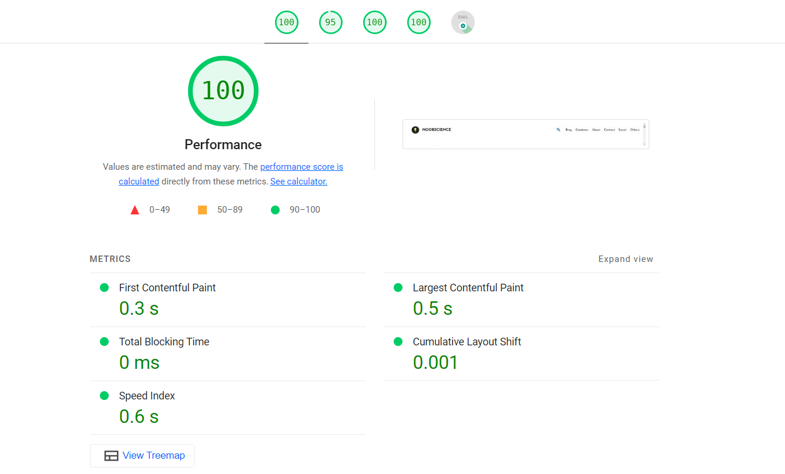

import YouTube from "../../../components/utils/md/social/youtube.astro"
import Twitter from "../../../components/utils/md/social/twitter.astro"
import Reddit from "../../../components/utils/md/social/reddit.astro"

Ever seen a gold fish? Beautiful creatures aren't they? There's something in the
way they move, something in the way they do it (Hey Ellie Goulding), that makes
them so mesmerizing. In the time when you were looking at the gold fish, the gold
fish might have already seen you, felt hungry, tried to eat something, and then
swam away. That's how short their attention span is. 9 seconds. That's all it takes
for them to forget what they were doing and move on to something else.

Now, hey there once more. If you survived reading the last paragraph, congrats!
You have a longer attention span than a gold fish. But, that's not saying much.
Now, I will stop with the gold fish analogy, mostly because I am quoting off
a study conducted by Microsoft Advertising, not the most unbiased source.
The now famous study, conducted in 2015, concluded that the average attention
span of a human being is 8 seconds. That's 1 second less than a gold fish.
All published in a report titled ["Attention Spans"](https://dl.motamem.org/microsoft-attention-spans-research-report.pdf), the study has been
quoted by many, and has been used to justify the shortening of content on many
platforms.

Now, I am not here to dispute or justify the study. I am here to talk about
about the more general idea of attention spans, how they are changing, and
what it means for us.

## Some History

Your attention span is the amount of time you can focus on something without
getting distracted. Now, by distraction, I mean the whole spectrum from
getting bored to sleeping. Basically, your attention span is your concentration.
So, now, your concentration getting shorter doesn't seem like a good thing, doesn't it.

Now, it is not like our attention spans are fixed for our life. It is not like a stat for our
character in a video game.
It is something that can be trained and improved. Through out out life, our attention span
keeps on changing.
For example, maybe a 22 year old can sit for a 3 hour lecture, but a 12 year old can't.
So, our attention span is not always the same. It changes with age, and it changes with time.
It however, may also change with other factors, like our health, our mental state, and
our environment. Now, the first two are beyond this article, but the third one is what I want to talk about.

Our environment is changing. We are living in a world where we are constantly bombarded with information and
are more connected than ever.
With all of this however, came the social media giants. Facebook, Instagram, Twitter, Snapchat, TikTok, and
many more. These platforms have changed the way we consume content. They have changed the way we interact with
each other and a lot more things that are fundamental to the human experience.
Now, for better or for worse is up to debate, but one thing is for sure, they have changed _the way_ and _the type_
of content we consume.

During the early days of the internet, the content was mostly text based. Long form content was the norm.
People used to spend hours reading articles and blogs, news sites were the most popular, and people used to
flock to the latest internet forums to discuss their favorite topics.

With the advent of social media too, content was still mostly text based. People used to post their thoughts,
their opinions, and their ideas. However, a new form of content was also emerging. __The image__. Now I believe
images changed the way we consume and build the internet. It was the first time we could see something on the
internet that was not text and people were hooked. We had photos, memes, and a lot more. Software like photoshop
came into play and stuff like Adobe Flash was used to create animations. The internet was changing.

Now, let's zoom into around the time when YouTube was launched. Now videos on the internet was not a new thing.
People had been uploading videos on the internet for a long time. However, YouTube changed the game. It was
the first time where people had a platform and a nice CDN to upload their videos. They had a community they can
interact with and all the cool stuff that comes with it. In the early days, most YouTube content was unregulated and 
it was mostly just people uploading the most random stuff. However, as time went on, people and the company
started to realize the potential of the platform. Google soon acquired YouTube and the rest is history.

## What is happening now?

Enter TikTok. Now, I am not going to talk about TikTok in detail, but I will say that it is the first platform
that was truly video and mobile first. It was as if TikTok took all the things that got people hooked to the 
internet in the first place and basically magnified it. You had short and snappy videos, a easy to operate interface, a
very addictive algorithm and basically anything that would _never_ let you get off the app.

Now, I am not saying that TikTok is the only reason why our attention spans are getting shorter. I am just saying
that gave rise to the culture of __bombarding__ your users with content that they would not normally consume otherwise.
It gave rise to the culture of __short__ and __snappy__ content. To engage your users, you no longer had to make
nice, long, and informative content. You just had to make them __feel__ something. Now, it can be anything, ranging from 
anger and dismay to happiness and joy. So, the whole narrative of the internet changed.
It shifted from consuming to __feeling__.

> "The internet shifted from consuming content to feeling from it."

I want you to question one more thing. Let's say you are doing a rather mundane task, like climbing the stairs or 
maybe eating (yes, I know I just called eating mundane). What do you do? You take out your phone and start scrolling.
You scroll basically anything, from Instagram to Reddit. You consume more content than food.
Now, this culture is something that's problematic. Scrolling is not good for our dopamine levels at all and it
is definitely not good for our attention spans. Dopamine is called the "happy" hormone. It is the hormone that is
responsible for the feeling of satisfaction and happiness. It is the hormone that is released when we do something
that our body likes. Now, dopamine is not bad. It is the reason we pretty much do anything. 

Now, I am not part of the whole "dopamine buff" culture. I am not saying that dopamine is bad. I am just saying
that the way we get it is bad. We are getting dopamine from the wrong means and the social media giants are
well aware of it. They are using it to their advantage and we are the ones who are suffering.

## Notice the small things

In the modern connected world, you _cannot_ quit social media, unless you want to be the guy who literally
lives under a rock. However, I only want you to simply notice
little things about the way we consume content and try to change that.

To do that, a simple way is I want you to ask yourself three simple questions

- When was the last time I simply sat down and did nothing?
- What was the last long form text content I consumed?
- When was the last time I did something when I was bored, that is not scrolling?

Chances are, most of us will not be able to answer these questions.
Just sitting down, getting bored is no longer a choice. I recently came across a YouTube video by Veritasium:

<YouTube id="LKPwKFigF8U" />

So, if you are up to it, watch the video. Done watching? Good. Now, I want you to think about the last time you
were bored. What did you do? Did you take out your phone and start scrolling? Did you start watching YouTube videos?
Or did you start playing a game? Chances are, you did one of these things. Now, I am not saying that these things
are inherently bad. That is not the point. The point is we are so used to being entertained all the time that we
_forgot_ how to be bored, be alone with our thoughts, and just sit down and do nothing.

There is a lot of uses to boredom. It is the time when you can think about your life, your goals, and your dreams.
Don't worry, you are not listening to a guy who is a productivity buff.
I'll give you a popular example

<Reddit id="r/ProgrammerHumor/comments/93eq0e/everytime/" />

If you are a programmer, I know you came across this meme at some point or the other.
It is quite true. I still to this day, get the most random ideas when I am bored.
Me not getting these ideas is why I wanted to change the way I consume content in the
first place, but more about my story later.

Next, let's go into consuming long form content. On YouTube, you might be familiar with the
whole docu-series genre. Most of them are pretty harmless and are actually quite informative, and 
if you are not the type of person to not watch them, that's fine. However, I want you to think about
the last time you saw one of them. Quite rare right? When was the last time you 
_read_ something, anything online. We now a days don't read news articles, we just read the headlines and 
scroll the content to find anything we find relevant. We don't read blog posts, like at all. Skimming 
has become the norm in this day and age. We don't read books, we just read the summaries. We don't watch 
movies, we watch their reviews and rants.

If you find a pattern here, you'll find that we are no longer giving ourselves a chance to think 
for ourselves. We are letting other people think for us and rewarding them for it.

So, the next time you are bored, let the noggins do the thinking. Don't let the internet do it for you.
It is okay to just not do anything. There is not hussle culture, no productivity culture, no nothing.
It's just you and your thoughts.
Meditate if you need to, but it's not necessary. Just to clarity, I am not asking 
you to take time out of your schedule to do this. I am just asking you to do this when you are bored and 
already have nothing to do.

<Twitter id="JamesClear/status/1296885438561517569" />

To answer the final question for you, the next time you are bored, do nothing, or better yet, just
learn how to do cool pen tricks. It is nerd approved.

## The Economics of Attention

The Economics of Attention is a double edge sword that we built for ourselves are now suffering from.
The reason it was popularized is to hook people on and now we are finding it more difficult than ever to 
even get people's attention, forget about hooking them, unless we are providing them with something that
is short, snappy, and makes them feel something. This is why we are seeing a rise in the whole "drama" culture.

Google recommends a site LSP (Largest Contentful Paint) to be under 1.2 seconds. That is the time it takes
for the largest content on your site to load, so it can be anything from a video to a image.
1.2 seconds is the time google says your visitor might just __lose interest__ and leave your site.
1.2 seconds! Hence, say hi to the world of AMP (Accelerated Mobile Pages), fast frameworks like Next.js, and
the whole "JAMStack" movement. We are now in a world where we are optimizing for speed and not for quality.
It doesn't matter if your content actually has some inherent values, as long as it is snappy and it emotionally
charges the user, you are good to go.

My Site is optimized for 0.4 seconds LSP BTW

More examples of such _self inflicted_ problems are the whole Shorts and Reels movement. YouTube, Instagram and
TikTok are now in a literal war to get your attention. YouTube pivoting to the short form content is a way 
understandable move, but Instagram literally changed their whole UI and algorithm to get you to watch Reels.

Are these moves even profitable? Instagram recently reported that they are not [profiting](https://observer.com/2023/02/mark-zuckerberg-says-meta-needs-to-monetize-reels-heres-how-it-could-happen/) off of Reels. 
So, why is Instagram so committed to the whole the reel movement? It is because they are in a war for your attention.
The more attention they get, they atleast have a _chance to monetize_ it.

Hence, you can clearly see the whole thing is so messed up. We are now in a world where we are optimizing for
speed and we will soon reach a point where we can no longer keep up with our own decreasing attention spans.
It is very _costly_ to optimize for speed. It is not only costly in terms of money, but also in terms of
labour and time.

## My Story

I don't why I end up doing this, but here is my experience with social media and how I changed the way I consume
content.

I started programming when I was 17. I did not have Instagram and basically no social media presence. I was
simply learning how to code and I was doing it for fun. 
I had so many ideas and I used to think very creatively. Wanna guess what I did when I was bored? I used to
just sit down and stare (don't imagine me staring at a wall, I used to stare at the ceiling) and I attribute a lot
of my interest and passion to coding to these random thoughts I used to have when I was bored.

I learnt slow and was just for fun. Boredom was a part of my life and I used to enjoy it. However, all that changed when 
I got my own phone and started using social media. I started using Instagram and the whole thing changed. I used to watch 
a lot of reels and as I mentioned in one my previous posts where I talked about why I was [leaving Instagram](/blog/social-media/oh-dear-instagram),
I once sat and unknowingly watched reels for 3-4 hours straight. I was hooked.

This is where I started to feel my mind a bit numb. I was no longer thinking creatively. I was no longer having
ideas for stuff I wanted to build. I was slowly starting to lose interest in coding. This was like a jerk reaction
to me. I was like, "I am not gonna let this happen to me". I was not gonna let social media take away my creativity, my
passion, and my interest in coding. So, I simply quit.

Was it easy? No. I had to go through a lot of withdrawal symptoms. I had to go through a lot of FOMO and I still do, but 
was it worth it? Yes. Will I ever go back? No.

## Conclusion

Let me continue the format I set up in the last paragraph. Does this post have conclusive and a proper ending? No.
However, I hope you did get something out of it. Social media and all of these platforms are not inherently bad, but
it is important to not forget your human side. Let's be conscious about our social media use. I know this is a cliche
thing to say, but control social media, don't let it control you.

With that note, allow me to end this post. I hope you enjoyed reading it. If you did, please consider sharing it with
your friends and family. Maybe challenge yourself to not use social media for a day or two. I am sure you'll find
it very refreshing. Till then, for long form content, you can always come back to my blog. I'll see you in the next one.
Thanks for reading. Hope you have a great day. Bye.