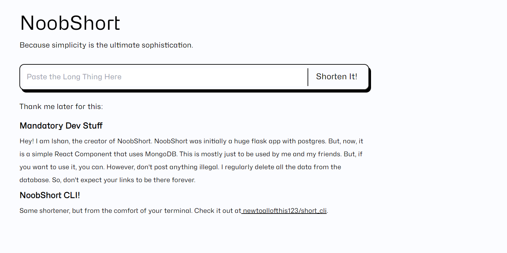
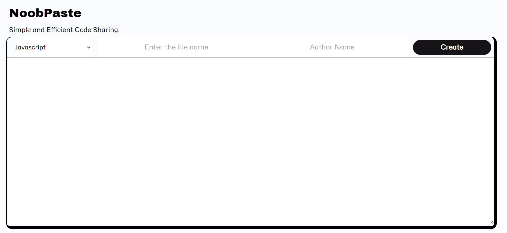
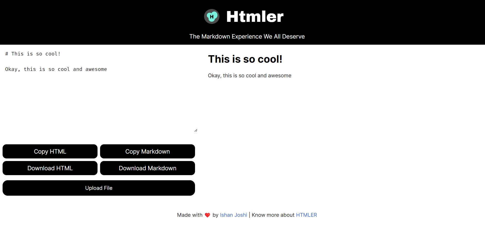

I am almost certain that if you are a web dev, actually scrap that, if you are a developer, you at some point or the other have 
built at least one of the following:
1. A URL shortener
2. Paste bin
3. Markdown editor
4. Todo list
5. A CLI (Any CLI, it doesn't matter)

These might seem very superficial and useless, but they are far from that. So this post is to show you how I built my own versions of these tools, and how you can too.
Maybe this article will inspire you to finally dig open the grave of that URL Shortener you started 2 years ago and never finished.
However, along the way, you might end up making some mistakes that I made, and I hope this article will help you avoid them.
With that out of the way, let's get started.

## What I have built

Well I have built a lot of things, most of them not worthy of being mentioned here. I am primarily a project based learner, so I learn by building things.
I honestly have a folder called "graveyard" where I keep all my failed projects. But I have built a few things that I am proud of, and I will be talking about them here.
Most of these tools are public, you can give them a try if you want. All of these are open source of course, and I will link the source code in the respective sections.
They are also quite easy to build yourself. I will be mentioning the architecture of these tools as well so you can build your own versions of them. However, you are free to also just
fork my repos and build on top of them. I will be happy to see what you build.

### [NoobShort](https://noobscience.rocks/go)

NoobShort is one project that I have a lot of memories with. It was first a very simple __URL Shortener__ built using Flask and Postgres. It was a very simple project, but it was one of my 
first major projects that I actually deployed. Back when heroku was free, it was called Shortpaw. You can actually still find the original source code [here](https://github.com/newtoallofthis123/shortpaw).
When heroku ended their free tier, I sort of abandoned it and started using other URL shorteners.
Shortpaw is an excellent learning experience for me. With a lot of hard work I introduced reactiviy to the app, using jquery and ajax. I also learned how to use Postgres and Flask.
This was a precursor to all the comforts that React and Next.js provide.

A while ago, when I was learning Next.js, I decided to build a URL shortener again. This time I decided to use Next.js and MongoDB. I also decided to make it a bit more advanced.
I coded an API and a beautiful frontend using tailwindcss and that was it for a while. Looking back, it was quite cool that I used a stack that is so easily deployable, nearly free.
So when I got my domain noobscience.rocks and started building a portfolio site, I just decided to leave it as a subsection of my portfolio site. I also decided to make it open source.
You can find the source code [here](https://github.com/newtoallofthis123/noobscience/tree/main/src/pages/go).

When I migrated my site to Astro, I just split it into API and frontend components. The frontend form is now a component that I can use anywhere. The API is part of Astro's serverless functions.
I decided to not allow anyone to custom slug URLs, because I didn't want to deal with the hassle of moderating them.
I also added a small rust CLI for it which makes it very easy to use. You can find the CLI [here](https://github.com/newtoallofthis123/short_cli").

That is how it looks. It is quite simple, but it works. I have also added a few features like custom slugs, and a few other things. I will be adding more features in the future.

### [NoobPaste](https://noobscience.rocks/code)

You know how you have that one project that has so much nostalgia attached to it that you just can't let it go? Well NoobPaste is that project for me. It was one of my first projects that I actually deployed.
It is once again built using Flask and Postgres. It is a very simple __Paste Bin__ that allows you to paste code and share it with others. It is very simple, but it works. I have used it a lot of times to share code with my friends.
Then original app was a huge flask app with a lot features like a full code editor, syntax highlighting, and a lot of other things. I have since then stripped it down to the bare minimum. You can find the original source code [here](https://github.com/newtoallofthis123/NoobPaste)

Now however, it is a very simple and beautiful frontend built using tailwindcss and a very simple API built using Next.js and MongoDB. I added the ability to handle all the code snippets from my custom built rust CMS which I will talk about in one my previous posts.
One of the most nostalgic things about this project is that I used to use it to share code with my friends.
I pretty much still use it for the majority of my code sharing. 
This is how it looks:

I hope you are able to see a pattern here. I am a huge fan of simple and minimalistic UIs. I also like to keep my projects as simple as possible. I don't like to add a lot of features to my projects.
Why? Well I'll be talking about that in a bit.

### [HTMLEr](https://noobscience.rocks/htmler)

Any markdown app that you use is probably a 100 MB download. I don't know why, but they are. I don't like that. I don't like downloading a 100 MB app just to write markdown!
So, I decided to build my own markdown editor. I decided to call it HTMLEr. It is a very simple __Markdown Editor__ built using plain HTML and JS. Okay I added a little of Tailwind CSS, but that's it.
I promise. The source code is very simple so if you are interested, you can check it out [here](https://github.com/newtoallofthis123/htmler).
It uses the `marked.js` library to convert markdown to HTML. I in fact am using it to write this article. It is very simple, but it works. The best feature? Every click is a save. So you don't have to worry about losing your work.
Everything and I mean everything is saved in the local storage. So you can close the tab, close the browser, restart your computer, and your work will still be there. 
You can even save it as a file. It is very simple, but it works. This is how it looks:

Quite fun and minimalistic right? I love it.
It is like my go to writing app. Best part? I just have to open a URL. No downloads, no installations, nothing. Just a URL. I love it. 

### [NoobKey](https://github.com/newtoallofthis123/noob_key)

NoobKey is a very simple Key Value store built using Rust. 
It wrote a lot about it in my previous post. You can check it out [here](https://noobscience.rocks/blog/tutorials/rust-cli).

## Why I built these tools

The internet is full of tools. There are so many. You have something for everything. Want to unwrap a JSON? There is a tool for that. Want to convert a PDF to a Word Document? There is a tool for that.
It is a wonderful eco system that we have built. But there is one problem. Most of these tools are either paid or have a lot of ads. I don't like that. I don't like paying for things that I can build myself.
That is just a personal preference. 

Keeping aside the fact about paying, there is something else that we need to take into consideration. Privacy. Most of these tools are not open source. So you don't know what they are doing with your data.
URL's for example are a _very_ private thing to share. You key value store is also a very private thing. You don't want to share it with anyone. So why would you use a tool that you don't know what it is doing with your data?
It is a very different story if the tool you are using is open source. But most of them are not. So I decided to build my own tools. I decided to build tools that I can trust. Tools that I know are not doing anything with my data.
Because I own my data. I even took it one step further and even bought my own domain.

I trust my tools because they are after all, my tools.
If I didn't like a feature, it is a commit away. If I suddenly find the whole UI ugly, that too, is just a commit away.
Moreover, once I figure out the API's and stuff, I can use them in my other projects as well. I can use my URL shortener in my portfolio site. I can use my paste bin to share code with my friends.
It just feels so empowering to have your own tools. It is like having your own super powers.

## Advice

While building these tools, I have made a lot of mistakes. Here are a few lessons that I learned along the way.

### Keep it simple stupid

Keep your tools as minimal as possible. There is no need to add authentication, or a CRUD API, or a lot of other things. Keep it simple. Keep it minimal.
You want to build a URL shortener? Just build a URL shortener. Don't unnecessarily add a lot of features. You can always add them later if you want to.
For example, my pastebin doesn't need a code editor. It is a pastebin. It is supposed to be minimal and fast. Just a `textarea` where I can paste my code and share it quickly with a very easy to access URL.
The syntax highlighting too is not very customizable. I just use a single `highlight.js` theme. I don't want to add a lot of themes either.

The more you try and add features, the more you will get distracted. The point is not to have a sass product that you can sell. The point is to have a tool that you can use.
The keyword being just `you`. You don't need to build a product. You just need to build a tool that you can use. So keep it simple. Keep it minimal.

### Don't over engineer

Choose a very simple and easily deployable stack. I chose Next.js and MongoDB. It is very easy to deploy. I can deploy it on Vercel for free and don't have to worry about it.
Not need to worry about scaling, misusing resources, or any of the stuff that I would have had to worry about if I had used something like Django or Express.
Similarly, I use Rust for building my CLI tools because it just works. I have never had a rust tool fail on me. It is very easy to build and install. Portable, functional and fast.
That is all I need.

### Don't over optimize

It is okay if your tool is not the most fastest, SEO optimized, or the most beautiful.
Remember you are the only one who is going to be using it. Yes other people can, but that is not the point. The point is to build a tool that you can use.
If other people start using it, good for you. But that is not the point. The point is to build a tool that you can use. So don't worry about SEO, or performance, or any of that stuff.

Remember it is _your_ tool so you can always optimize it later if you want to, but you don't need to. If you chose a simple stack, you probably have enough server resources to not worry about performance.
Remember your tools is not a product. It most probably wont' have a lot of concurrent users and that is okay.

### It is for you

Not for anyone else. You are building this tool for yourself. So don't worry about what other people think. If you want to add a feature, add it. If you don't want to, don't.
For example, I always found the QR code feature in URL shorteners to be very useless. I never used it. So I didn't add it. I don't care if other people want it. I don't want it, so my tool doesn't have it.
Yes, it really does feel that powerful. You can build your own tools, and you can build them however you want. 

### Don't be afraid to change

Delete the whole project if you want to. It is your project. Let it grow with you. If you want to change the stack, change it. If you want to change the UI, change it.
Let your tools reflect your unique personality. Give them space to breath. They are not putting bread on your table and are not supposed to. They are just tools that you can use.

## Some Observations

My work flow with these tools is quite simple actually. I use my URL shortener to shorten all my URLs. I use my paste bin to share code with my friends.
The markdown editor is what I use to write all my articles. I use my key value store to store all my keys and secrets. 
The Custom rust CMS that I built is used to manage the whole MongoDB.
Hence, I don't need to build a lot of features into my tools. I don't need to add authentication, or a lot of other things. 
ALl my tools don't even have the option to delete anything because I don't need a bloated UI for that, nor do I need to worry about security of my data.
If I want to delete something, I just use the CMS CLI to delete it. It is that simple.

Moderation? What even is that? I obviously won't be sharing any illegal stuff on my tools, but still, the feeling of not being moderated is quite liberating.
What about me being a bad actor? Well first up, all of my tools are open source. So you can see what they are doing. Second, I am not a bad actor. I don't want to be one.
All this is quite cool and all but what about others being bad actors? Well, the DB is in my control. I can always delete stuff if I want to. In fact, about once every month, I just delete the last 100 entries of my URL shortener.
I don't need them. I don't want them. So I just delete them. It is that simple.
Some of the more permanent stuff like my keys and secrets are stored in my key value store. I don't need to delete them. I just update them if I want to.
It is honestly so cool.

## Conclusion

Well, this was once again, one of those weird posts that I just wanted to write. I hope you enjoyed it. I hope you are inspired to build your own tools.
If you do end up building something, do let me know in the comments. I would love to see what you build. I hope you learned something from this post.
It is always liberating to start having your own spaces on the web, be it a blog or a tool. It is a very different feeling. I hope you get to experience it and I hope you enjoy it as well.
So, I hope I have inspired you enough to start digging your old projects and start building your own tools. Remember, it is not about someone else using your tools. It is about you using your tools.
So, build it in such a way that you can use it. Making it public is just a bonus. So, go ahead and build your own tools. I hope you have fun doing it. I know I did.
Thanks for reading. Have a nice day. Bye.

## PS

Here are the links to all the tools that I mentioned in this post:

1. [NoobShort](https://noobscience.rocks/go) | [CLI](https://github.com/newtoallofthis123/short_cli) | [Source Code](https://github.com/newtoallofthis123/noobscience/tree/main/src/pages/go) 
2. [NoobPaste](https://noobscience.rocks/code) | [Source Code](https://github.com/newtoallofthis123/noobscience/tree/main/src/pages/code)
3. [HTMLEr](https://noobscience.rocks/htmler) | [Source Code](https://github.com/newtoallofthis123/htmler)
4. [NoobKey](https://github.com/newtoallofthis123/noob_key)

Small disclaimer before using them though. All of their content is _clearly_ visible to me. So don't share anything that you don't want me to see. I don't care about your data, but I can see it and I am not comfortable with that.
Care about your data. Be safe. If you want to use them, I recommend you fork them and build your own versions. I will make a future blog post or maybe a doc on how to do that.
Keep upto date with my blog to know when that happens. Thanks for reading. I hope you find my tools useful. I know I do.