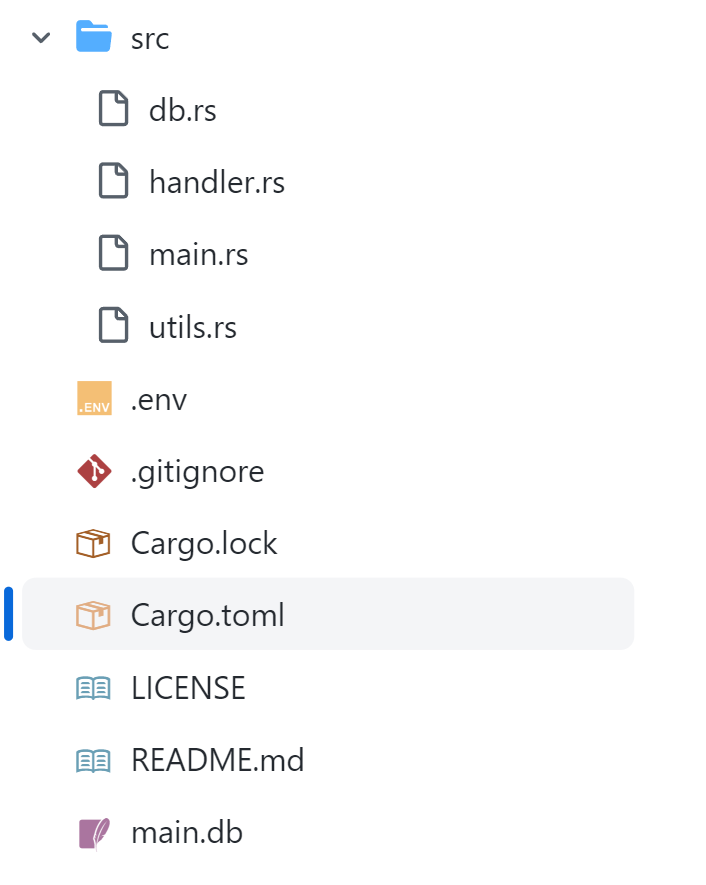

import Disclaimer from "../../../components/utils/md/disclaimer.astro"

The world of the terminal is beautiful and I always love dwelling in it. Away from the small old experience of the web which I am finding is quite “routine” now a days, you can build a little corner where you are in *total control*. So, here is a small tutorial on building your own small CLI in rust. I’ll be going through how to prettify the output, connections and more. So, let’s get started.

<Disclaimer>
This tutorial is by no means to a complete guide. This is just to show you the basic way you can approach making a CLI and how to sort of 
go about making it. This article also presumes that you have a good enough knowledge of the rust language. If you don’t, I recommend you check out the official rust book. It is a very good resource for learning rust. You can find it here: [https://doc.rust-lang.org/book/](https://doc.rust-lang.org/book/)
</Disclaimer>

## What are we building?

So, what we are going to build is actually quite simple and you might actually find it useful. We are going to build a “Key-Value” Store. So, the concept is quite simple. We have 5 commands

1. Add a Key-Value [C]
2. Read a Value from Key [R]
3. Update a Value from Key [U]
4. Delete a Value from key [D]
5. Search a Key / Value [S]

The classic CRUDS App.
So, this is how we are going to do this.

## Enter Rust

We will be using rust. Rust is a very simple to use memory and type safe language that is excellent for building cool and reliable CLI’s. In fact it has quickly become the number one tool for building CLI’s. I’ll dive into more on why rust CLI’s are good in a future blog post, so stay tuned for that.
So, with that, let’s get our project set up.
Install rust on your machine if you have not already. You can do so by visiting
[Rust Programming Language](https://rust-lang.org/)
and just downloading rust for your platform.
Once that is done, just head over to your terminal. The terminal is an excellent way to interact with your computer. If you want to know the basics, there are plenty of resources on YouTube, below is one I recommend from freeCodeCamp.
With that, `cd` into a new directory and run

```bash
cargo init . --bin --name "nkv"
```

We are using `--bin` to signify to cargo that we will be using this as a binary rather than a crate, just to make it clear.
Now, open this up in your favourite text editor. I personally use VSCode (I know shocking), but rust has a very good ecosystem for Neovim and Emacs as well.
Now, create all the files shown below



Don’t worry, you don’t need to have SQLITE3 installed to have this work. We will be directly using rust a crate. Let’s just quickly go over the file structure:

We are going to have four files in the `src`, including the `main.rs`:

- *[db.rs](http://db.rs/)*: Handles database connections and the CRUD operation’s brain
- *[handler.rs](http://handler.rs/)*: Essentially acts as a middle ware
- *utils.rs*: For some cool utility functions like copying, hash generation etc.
- .env file to store our Database address
- main.db, which is our dev database.

Now that you have created these files, it is time to install some crates. Crates are independent rust libraries that provide additional features on top. They are built and maintained by the community and are very useful. It is very easy to install them in your rust project. Just head over to `cargo.toml` and under `[dependencies]`, just paste the dependency name. I’ll be listing what we are using below, however, if you want to find more rust crates, I recommend you check out the GitHub List linked below.

import GitHub from "../../../components/utils/md/github.astro"

<GitHub id="rust-unofficial/awesome-rust" />

This is going to to our `cargo.toml`

```toml
[package]
name = "nkv"
version = "0.2.0"
edition = "2021"

[dependencies]
clap = {version = "4.3.23", features = ["derive"]}
sqlx = { version = "0.7", features = [ "runtime-tokio", "sqlite" ] }
serde = {version = "*", features=["derive"]}
bunt = "*"
inquire = "*"
tokio = {version="*", features=["full"]}
chrono = "*"
clipboard = { version = "0.5.0"}
rand = "*"
dotenv = {version="*"}
tabled ={ version="*"}
human-panic = "*"
```

We will be using quite a bit of dependencies to make a pretty CLI. The `clap` dependency is a very simple to use CLI argument parser that uses a predefined struct to manage. `sqlx` is a simple SQL binder, not ORM for rust that makes it very easy to execute SQL queries on our database.

`serde` is a popular JSON library, we use `chrono` for managing time related stuff. `clipboard` is an intuitive Clipboard abstraction for rust. `rand` is random generation, `dotenv` for reading from the .env file, `tabled` to style a struct into a table and `tokio` to make our function asynchronous, so execution will be blocked till our database is queried.
`bunt` and `inquire` are CLI formatting and prompting libraries that are similar to the `rich` library in python
Woah. So we are done with libraries. Be sure to also include the same features I did since we will be using all of them.

## Let’s Start

Now, we can finally start the actual coding. Open `[main.rs](http://main.rs)` file and configure the `clap::Parser` to a nice struct.

```rust
use clap::Parser;
use dotenv::dotenv;
use human_panic::setup_panic;

#[derive(Parser, Debug)]
#[command(name="NoobKey", author="Ishan Joshi", version, about="A Simple Key Value Store", long_about = None)]

//? The Args struct is used to parse the command line arguments
struct Args {
    #[arg(required=false)]
    cmd: Option<String>,

    #[arg(short, long)]
    custom: Option<String>,

    #[arg(short, long)]
    docs: bool,
}

mod db;
mod utils;
mod handler;
```

The `cmd` is a Optional argument and we will prompt the user if it is not entered. We want this CLI for personal use, so no need to worry too much.
We also add all the files to the main file as mods.
Now, in the main function, all the predefined `dotenv().ok()`; `setup_panic!()`
These will take care of the environment and errors in production. Now let’s parse the arguments and check if the user enter the command. If he has not, let’s ask him

```rust
let args = Args::parse();

    let cmd:String;
    if args.cmd.is_some(){
        cmd = args.cmd.unwrap();
    }
    else{
        cmd = inquire::Text::new("Enter Command: ").with_help_message("Enter a valid command").with_autocomplete(
            &utils::suggester,
        ).prompt().unwrap();
    }
```

The `utils::suggester` is a simple filter and map function that inquire takes as input, this is the function. You can open up utils and paste this into it

```rust
pub fn suggester(val: &str) -> Result<Vec<String>, Box<dyn std::error::Error + Send + Sync>> {
    let suggestions = [
        "get",
        "set",
        "delete",
        "list",
        "search",
        "help",
        "exit",
    ];

    let val_lower = val.to_lowercase();

    Ok(suggestions
        .iter()
        .filter(|s| s.to_lowercase().contains(&val_lower))
        .map(|s| String::from(*s))
        .collect())
}
```

We basically just add a simple rust filter map function.

## The Database

Let’s configure the database connection now. First, open up [db.rs](http://db.rs) and import the necessary modules and define a struct of how our Database query would look like.

```rust
use sqlx::Connection;
use serde::{Deserialize, Serialize};
use sqlx::Row;

#[derive(sqlx::FromRow, Serialize, Deserialize)]
pub struct Entry {
    pub id: i32,
    pub key: String,
    pub value: String,
    pub hash: String,
    pub created_at: String,
}
```

We use serde to Serialize and DeSerialize data, that is derived from sqlx.
Our entry will have a simple id, key, value, hash and timestamp. Quite a simple and easy to work structure.
Now, let’s get the Database connection using `sqlx` and return a connection to the table I am calling `entries`

```rust
async fn get_db() -> sqlx::Result<sqlx::SqliteConnection> {
    //used to connect to the DATABASE_URL
    // It can be any valid SQLite connection string
    sqlx::SqliteConnection::connect(format!("sqlite:{}", std::env::var("KEY_STORE").unwrap()).as_str()).await
}

pub async fn connect() -> sqlx::SqliteConnection {
    //create table todo if not exists
    let mut conn = get_db().await.expect("Error connecting to db");
    let _ = sqlx::query(
        r#"
        CREATE TABLE IF NOT EXISTS entries (
            id INTEGER PRIMARY KEY AUTOINCREMENT,
            key TEXT NOT NULL,
            value TEXT NOT NULL,
            hash TEXT NOT NULL,
            created_at TEXT NOT NULL
        )
        "#,
    ).execute(&mut conn).await.unwrap();
    conn
}
```

As you can see, in the connect function, we just use a SQL query. No ORM needed.

Now, we can use the `connect()` function to just return a connection from the db, without having the need to reconnect everytime.

We now define an `add_to_db` function, the create part of CRUD

```rust
pub async fn add(key: String, value: String, hash: String){
    let mut conn = connect().await;
        let _ = sqlx::query(
        r#"
        INSERT INTO entries (key, value, hash, created_at)
        VALUES (?, ?, ?, ?)
        "#,
    )
        .bind(key)
        .bind(value)
        .bind(hash.clone())
        .bind(chrono::Local::now().to_rfc3339())
        .execute(&mut conn)
        .await.expect("Error adding entry");
}
```

As you can see, we just used simple SQL. `sqlx` allows us to bind the `?` with a value, which is exactly what we did. We also used the `chrono::Local` time in a the ISO format as the timestamp.

We similarly write rest of the RUD:

```rust
//get from db
pub async fn get(key: String) -> sqlx::Result<Entry> {
    let mut conn = connect().await;
    let row = sqlx::query("SELECT * FROM entries WHERE key = ?")
        .bind(key)
        .fetch_one(&mut conn)
        .await?;
    Ok(Entry {
        id: row.get(0),
        key: row.get(1),
        value: row.get(2),
        hash: row.get(3),
        created_at: row.get(4),
    })
}

//delete from db
pub async fn delete(key: String) -> sqlx::Result<()> {
    let mut conn = connect().await;
    sqlx::query("DELETE FROM entries WHERE key = ?")
        .bind(key)
        .execute(&mut conn)
        .await?;
    Ok(())
}

//list all entries
pub async fn list() -> sqlx::Result<Vec<Entry>> {
    let mut conn = connect().await;
    let mut entries = vec![];
    let rows = sqlx::query("SELECT * FROM entries")
        .fetch_all(&mut conn)
        .await?;
    for row in rows {
        entries.push(Entry {
            id: row.get(0),
            key: row.get(1),
            value: row.get(2),
            hash: row.get(3),
            created_at: row.get(4),
        });
    }
    Ok(entries)
}

//list all keys
pub async fn list_keys() -> sqlx::Result<Vec<String>> {
    let mut conn = connect().await;
    let mut keys = vec![];
    let rows = sqlx::query("SELECT key FROM entries")
        .fetch_all(&mut conn)
        .await?;
    for row in rows {
        keys.push(row.get(0));
    }
    Ok(keys)
}
```

## The Handler

We now define a middleware like file to handle all the operations and display appropriately to the user. For example, we can ask the user to add like this

```rust
pub async fn add(){
    bunt::println!("Executing add command...");
    let key = inquire::Text::new("Enter Key: ").with_help_message("Enter any identifier").prompt().unwrap();
    let value = inquire::Text::new("Enter Value: ").with_help_message("Enter any value").prompt().unwrap();
    let hash = super::utils::random_hash();
    super::db::add(key.clone(), value.clone(), hash).await;
    bunt::println!("Added entry: {$green}{}{/$}", key);
    bunt::println!("Value: {$yellow}{}{/$}", value);
}
```

Now that we have defined the `add`, we can just use a match statement in the main file to call the handler

```rust
match cmd.as_str() {
        "set" => handler::add().await,
        "list" => handler::list().await,
        "delete" => handler::delete().await,
        "get" => handler::get().await,
        "search" => handler::search().await,
        "exit" => {
            bunt::println!("{$red}Exiting...{/$}");
            std::process::exit(0);
        }
        "help" => todo!("Help command not implemented"),
        _ => todo!("Command not found")
    }
```

Like I defined the functions, similarly, you can define your own as well.

Now, this is where I leave you.

## Conclusion

The whole point of this article was to help you take your first steps in writing your own CLI using rust and the whole point would be lost if I impose my own ideas on to you. You are now free to create your own CLI.
Format it as you like. Maybe using a little bit of rust magic, you can make a very pretty CLI.
You are free to use `NoobKey` for reference, or even build on top of it. It is quite simple and easy to use codebase. This is it’s GitHub repo:

{/* <GitHub id="newtoallofthis123/noob_key" /> */}

With that being said, thank you for reading. The real reason I wrote this article was to test how code blocks look on my site 😅. You can check that out here: [https://noobscience.rocks/blog/tutorials/rust-cli](https://noobscience.rocks/blog/tutorials/rust-cli). Thanks for reading, hope you have a great day.